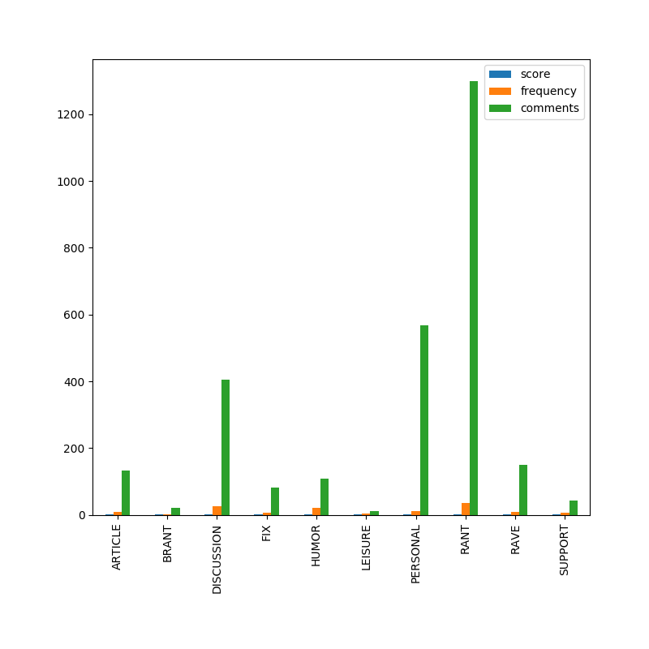
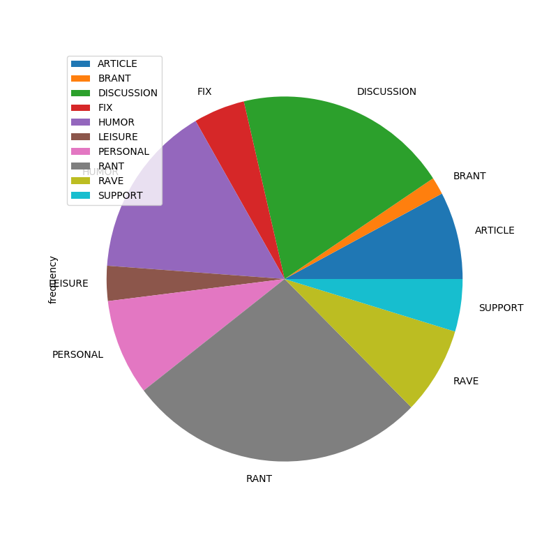

# Reddit Flair Analytics

Python bot to analyse a subreddit history and create pretty graphs from the results.

### Install dependencies

    pip3 install -r requirements.txt

### Arguments

* -h, --help            Show this help message and exit
* -s , --sub            Which subreddit to target
* -d , --days           How many days to get
* -m , --months         How many months to get
* -y , --years          How many years to get

### Run it

Get 1 day/month/year of data from /r/childfree

    python3 run.py -d 1 -s childfree
    python3 run.py -m 1 -s childfree
    python3 run.py -y 1 -s childfree

Graphs are saved to the graphs directory.
